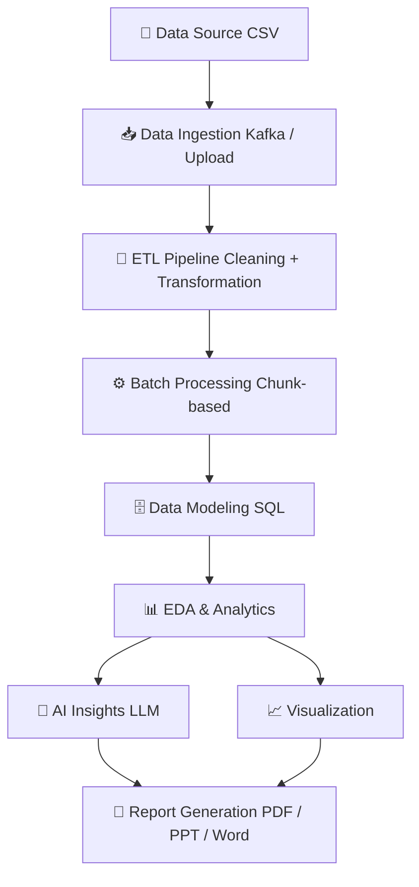

```markdown
<div align="center">

# 📊 Data Snap Agent
**AI-Powered Data Pipeline & Automated EDA System**

[](#)
[](#)
[](#)
[](#)
[](#)

*Transform raw datasets into actionable insights automatically with scalable processing and AI-driven reporting.*

</div>

---

## 🚀 Overview
**Data Snap Agent** is an end-to-end data engineering and analytics platform. It integrates data ingestion, ETL pipelines, batch processing, analytics, and AI-driven reporting into a single, cohesive workflow.

**Goal:** Eliminate manual data analysis bottlenecks and enable fast, scalable, and intelligent data processing for better decision-making.

---

## 🏗️ Architecture



---

## ⚙️ Tech Stack

| Category | Technologies |
| :--- | :--- |
| **Languages** | Python, SQL |
| **Data Engineering** | Apache Kafka, ETL Pipelines, Chunk-based Batch Processing |
| **Data Processing** | Pandas, NumPy |
| **Visualization** | Matplotlib, Seaborn, Plotly |
| **Backend** | Flask / FastAPI |
| **AI Layer** | LLMs (for automated insights & explanations) |
| **Storage** | Local Storage, Google Cloud Storage (GCS) |

---

## 🔄 Key Features

* **✅ Data Ingestion:** Upload CSV datasets with automatic schema validation for structured data.
* **✅ Robust ETL Pipeline:** Automated missing value handling, duplicate removal, and data type detection.
* **✅ Scalable Processing:** Memory-efficient, chunk-based batch processing for handling large datasets without crashing.
* **✅ Automated EDA:** Instant statistical analysis (mean, median, standard deviation) and feature-level correlation insights.
* **✅ Visualization Engine:** Auto-generates histograms, heatmaps, box plots, and bar charts.
* **✅ AI-Powered Insights:** Natural language explanations of data trends, quality detection, and actionable recommendations.
* **✅ Exportable Reports:** Instantly generate professional PDF reports, PowerPoint presentations, and Word documents.

---

## 📂 Project Structure

```text
Data-Snap-Agent/
│
├── app/                  # Application core (API routing & config)
│   ├── main.py
│   ├── routes.py
│   └── config.py
│
├── data/                 # Data storage (git-ignored)
│   ├── raw/
│   ├── processed/
│   └── outputs/
│
├── pipeline/             # Core engineering & ETL
│   ├── ingestion.py
│   ├── preprocessing.py
│   ├── processing.py
│   ├── modeling.py
│   └── analytics.py
│
├── visualization/        # Graphing & UI plotting
│   ├── plots.py
│   └── dashboard.py
│
├── ai/                   # LLM integration & intelligence
│   ├── insights.py
│   └── recommendations.py
│
├── reports/              # Document generation logic
│   ├── pdf_generator.py
│   ├── ppt_generator.py
│   └── word_generator.py
│
├── utils/                # Shared utilities
│   ├── helpers.py
│   └── validators.py
│
├── requirements.txt      # Project dependencies
├── README.md             # Project documentation
└── .gitignore            # Ignored files & folders
```

---

## ⚡ Installation

**1. Clone the repository**
```bash
git clone [https://github.com/your-username/data-snap-agent.git](https://github.com/your-username/data-snap-agent.git)
cd data-snap-agent
```

**2. Create a virtual environment (Optional but recommended)**
```bash
python -m venv venv
source venv/bin/activate  # On Windows use `venv\Scripts\activate`
```

**3. Install dependencies**
```bash
pip install -r requirements.txt
```

---

## ▶️ Usage

Start the main application server:

```bash
python app/main.py
```

**Standard Workflow:**
1. Upload your target `.csv` file via the interface.
2. The system automatically processes, cleans, and structures the data.
3. View the generated insights, correlations, and visualizations on the dashboard.
4. Download the comprehensive automated report.

---

## 🎯 Use Cases

* **Business Analytics:** Automate weekly metric reporting and trend discovery.
* **Data Exploration:** Rapidly understand new, unfamiliar datasets.
* **Academic Research:** Streamline the data cleaning and statistical visualization phases.
* **Data Engineering:** Serve as a foundational preprocessing pipeline for larger machine learning workflows.

---

## 🚀 Future Enhancements

- [ ] **Real-time Streaming:** Full Kafka integration for live data feeds.
- [ ] **Distributed Processing:** Apache Spark integration for massive scale.
- [ ] **Cloud Deployment:** Dockerized containers for AWS/GCP/Azure.
- [ ] **AutoML:** Automated machine learning model training and hyperparameter tuning.
- [ ] **Multi-Dataset Comparison:** Relational analysis across different uploaded files.

---

## 🤝 Contributing

Contributions, issues, and feature requests are welcome! 
Feel free to check the [issues page](https://github.com/your-username/data-snap-agent/issues) if you want to contribute. For major changes, please open an issue first to discuss what you would like to change.

---

## 📜 License

This project is open-source and available under the [MIT License](LICENSE).

---

## 👨‍💻 Author

**Pranjal Upadhyay** 📧 [write2mepranjal@gmail.com](mailto:write2mepranjal@gmail.com)  
🔗 [GitHub](https://github.com/your-username) | [LinkedIn](https://linkedin.com/in/your-profile)

<br>

*If you found this project helpful, please give it a ⭐!*
```

